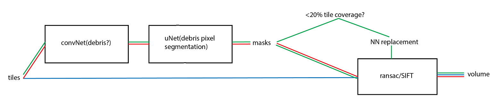

# Mask_Unet

Two-stage pipeline for automated debris detection and segmentation in electron microscopy tiles:
1) binary classifier (debris vs no debris)
2) U-Net segmentation model for debris masks.

## Overview

- Detects tiles containing debris using a ResNet34 CNN-based classifier.
- Segments debris pixels using a ResNet34 U-Net.
- Designed for large-scale EM datasets (trained on HPC), with small demo data and notebooks for local exploration.



## Features

- Binary debris classifier (`DebrisClassifier`).
- U-Net-based segmentation model (`get_segmentation_model`).
- Modular training loops for classifier and segmentor.
- Generic inference pipeline (classifier-only, segmentation-only, or full pipeline).
- Jupyter notebooks for qualitative evaluation. 


## Repository Structure

```text
📦 Mask_Unet/
 ┣ 📂 mask_unet/
 ┃ ┣ 📄 __init__.py
 ┃ ┣ 📄 torchdataset.py
 ┃ ┣ 📄 models.py
 ┃ ┣ 📄 inference.py
 ┃ ┗ 📂 training/
 ┃    ┣ 📄 __init__.py
 ┃    ┣ 📄 train_classifier.py
 ┃    ┗ 📄 train_segmentor.py
 ┣ 📂 scripts/
 ┃ ┣ 📄 train_binary_classifier.py
 ┃ ┣ 📄 train_segmentation.py
 ┃ ┣ 📄 run_inference_binary_classifier_segmentation.py
 ┃ ┗ 📄 run_inference_segmentation.py 
 ┣ 📂 notebooks/
 ┃ ┣ 📄 evaluate_classifier.ipynb
 ┃ ┗ 📄 evaluate_segmentation.ipynb
 ┣ 📂 debris_data/
 ┣ 📂 models/
 ┣ 📂 config/
 ┣ 📂 Legacy/
 ┗ 📄 README.md
```

## Installaton 

🔧 Installation

1. GPU Installation (HPC — CUDA 12.4)

install and load CUDA 
modify the .yml script to download the corresponding pytorch version
conda env create -f environment_GPU_HPC.yml

2. CPU Installation (Local Development)
conda env create -f environment_CPU.yml

## Data

A small **demo dataset** is provided under `debris_data/` for running the notebooks and example scripts.

Full training data used in my experiments is **not** included in the repo (large EM datasets on the cluster). To train on your own data, update the paths in the config

## TODO / Future Work

- [ ] Add YAML-based configuration for data paths and hyperparameters.
- [ ] Add metrics (Dice / IoU) to segmentation evaluation.

## Author

Ben Grainger  
5th year Neuroscience PhD (Sainsbury Wellcome Centre)  
Focus: large-scale EM data, automated debris detection & cleanup. 


  


